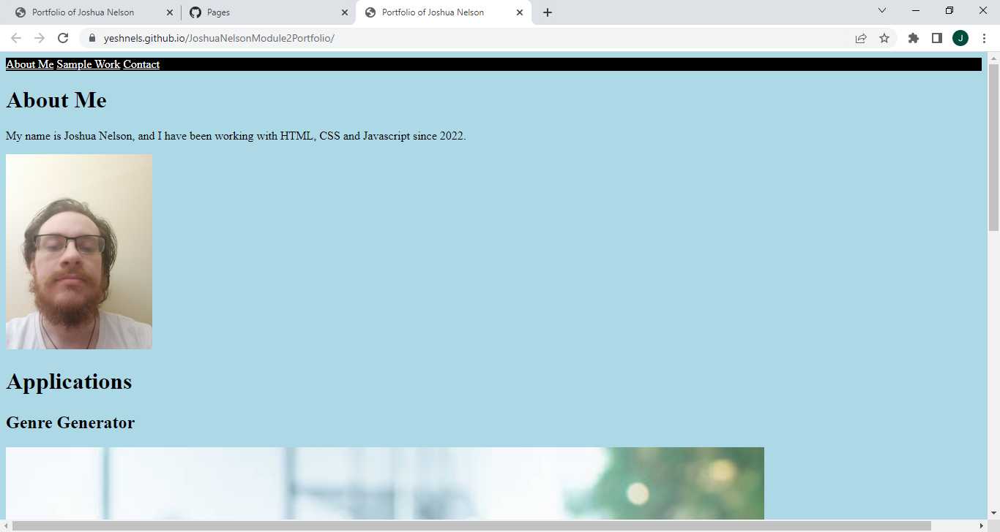

# JoshuaNelsonModule2Portfolio
A short portfolio of my own work that will be updated as the course goes on.
Currently contains my three most complete pieces of work but this will grow with the coming months.
I have placed the link to my collaborative project front and center as I believe that it should be my most prominent piece.
A large amount of the code for this project, in particular the CSS has been cannibalized from the CSS framework cheatsheet in order to quickly set up the portfolio.
This portfolio has been deployed at https://yeshnels.github.io/JoshuaNelsonModule2Portfolio/ and I will be taking care to remember to update this location as I create more and more pieces of work.

(
